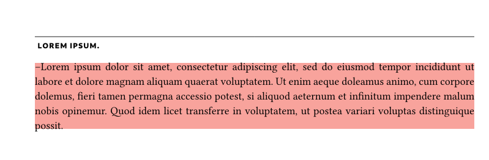
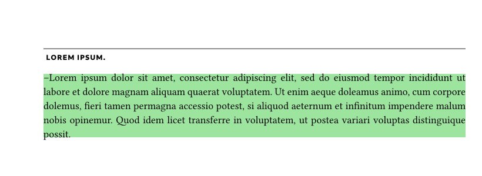
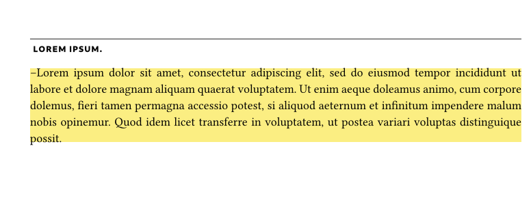
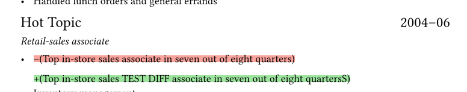

# How does our comparing work?

When comparing two AST trees of types files we have a few possibilities of coloring the 
compared trees:

If section was **deleted** it will be red

If section this section was **added** it will be green

If section this section was **moved** it will be yellow

If section was **modified** it will be shown like that:



## How does algorithm work:
example based on fictional nodes:
```html

nodes1:     nodes2
Node0       Node1
Node1       Node5
Node2       Node2
Node3       Node55
Node99      Node4
Node4       Node3
Node5       Node60


result:
Node0 -- deleted
Node1
Node5 -- marked
Node2
Node55 -- added
Node4 -- marked
Node3
Node99 -- deleted
Node69 -- added
```

**Python code** (less complex for easier understainsing of algorythm)
```python
def compare_nodes(list1, list2):

    # tylko po różnice to jest
    set1 = set(list1)
    set2 = set(list2)
    deleted_nodes = set1 - set2
    added_nodes = set2 - set1


    result = []
    resultFlags = []

    len1, len2 = len(list1), len(list2)
    i, j = 0, 0

    while i < len1 or j < len2:
        if i < len1 and list1[i] in deleted_nodes:
            result.append(list1[i])
            resultFlags.append('Deleted')
            i += 1
        elif j < len2 and list2[j] in added_nodes:
            result.append(list2[j])
            resultFlags.append('Added')
            j += 1
        elif i < len1 and j < len2 and list1[i] == list2[j]:
            result.append(list1[i])
            resultFlags.append('Same')
            i += 1
            j += 1
        elif (i < len1 and j < len2 and list1[i] != list2[j]) or (j >= len2 and i < len1):
            if list1[i] in result:
                i += 1
            elif list2[j] in list1:
                result.append(list2[j])
                resultFlags.append('Marked')
                j += 1

    return result, resultFlags


```
_Rust code is in source code_


##### What will not be supported:
- If the module will be at the same time modified and moved it will be shown as deleted and added in different place